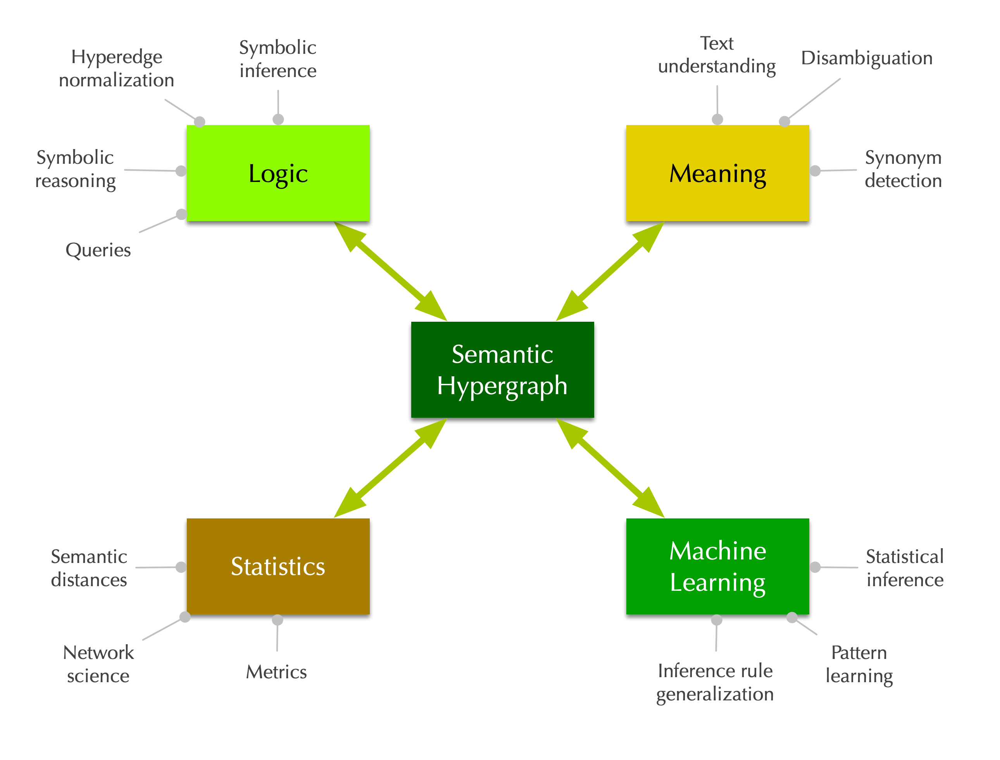

.. note:: **NEW PUBLICATION**: The preprint of our first Graphbrain-related article `"Semantic Hypergraphs" is now available at arXiv <https://arxiv.org/abs/1908.10784>`_.

.. raw:: html

    

    
    

    <form action="https://groups.io/g/graphbrain/signup?u=6083259733828458523" method="post" id="groupsio-embedded-subscribe-form" name="groupsio-embedded-subscribe-form" target="_blank">
        

          <label for="email" id="templateformtitle">Subscribe to our mailing list</label>
          <input type="email" value="" name="email" class="email" id="email" placeholder="email address" required="">
          <input type="submit" value="Subscribe" name="subscribe" id="groupsio-embedded-subscribe" class="button">
        

    </form>
    

    

      

Graphbrain -- Language, Knowledge, Cognition
============================================

Graphbrain is an Artificial Intelligence open-source software library and scientific research tool. Its aim is to facilitate automated meaning extraction and text understanding, as well as the exploration and inference of knowledge.  It is part of `socsemics <https://socsemics.huma-num.fr/>`_, a research project funded by the European Research Council and focused on the fragmentation in online public spaces.

The ambition of this project is not simply to contribute to advancing the state-of-the-art in AI, but principally to be an effective interdisciplinary research tool. More specifically, we are interested in advancing the possibilities of automated meaning extraction for research in fields such as Computational Social Sciences, Cognitive Science and the Humanities.

Graphbrain is experimental in nature, but with a unifying concept: the *semantic hypergraph*. It follows a hybrid approach, combining symbolic AI and statistical/connectionist Machine Learning methods. This is for two main reasons: to facilitate understandability and reproducibility for human researchers and to combine the strengths of both approaches.

Graphbrain is written in Python, to both take advantage and facilitate integration with the rich environment of scientific libraries available in this language. It is released under the highly permissive MIT open source license.

.. toctree::
   :maxdepth: 2
   :caption: Contents:

   installation.rst
   overview.rst
   tutorials.rst
   reference.rst
   cli.rst
   team.rst

Indices and tables
==================

* :ref:`genindex`
* :ref:`modindex`
* :ref:`search`
