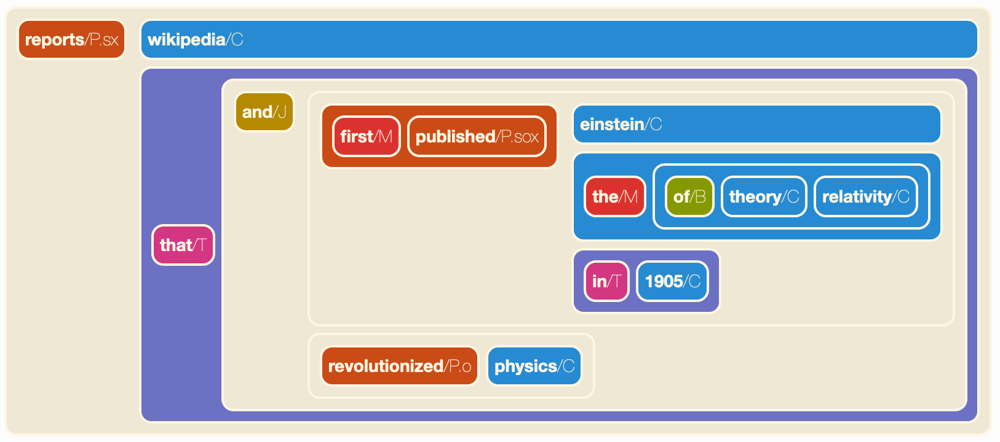

============================
Notebooks and visualizations
============================

The ``graphbrain.notebook`` package contains functions that are specifically meant for use with Jupyter notebooks. Currently it provides three hyperedge visualizations, meant to be used inside notebooks.

The function ``show()`` produces a indented visualization with syntax highlighting according to hyperedge type::

   from graphbrain.notebook import *
   show('((first/M published/P.sox) einstein/C (the/M (of/B theory/C relativity/C)) (in/T 1905/C))')

The optional argument ``style`` specifies layout style. The two possible options are "indented" (the default) and "line".

.. image:: ../_static/show.png
  :width: 50%
  :alt: Example of hyperedge visualization with show().
  :align: center

The function ``blocks()`` produces a block diagram, also using colors to distinguish hyperedge types::

   blocks('((first/M published/P.sox) einstein/C (the/M (of/B theory/C relativity/C)) (in/T 1905/C))')

.. image:: ../_static/block.png
  :width: 75%
  :alt: Example of hyperedge visualization with blocks().
  :align: center

The function ``vblocks()`` also produces a block diagram similar to ``blocks()``, which is more vertically spread and might thus be preferable for complex hyperedges::

   from graphbrain import hedge
   edge = hedge("""(reports/Pd.sx wikipedia/C (that/T
                    (and/J
                        ((first/M published/Pd.sox) einstein/Cp.s (the/M (of/B theory/C relativity/C)) (in/T 1905/C))
                        (revolutionized/P.o physics/C))))""")
   vblocks(edge)

Both ``blocks()`` and ``vblocks()`` accept the optional arguments "subtypes" (default: False), "argroles" (default: True) and "namespaces" (default: False). These are meant to control the level of detail at which atoms are represented.
